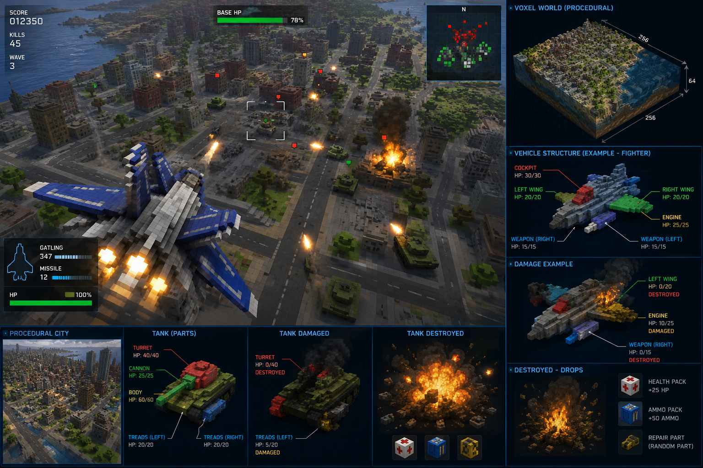

# Project VOXFALL — an Urban Assault remake in a procedural voxel world

> Working title: **Voxfall** (placeholder — "Urban Assault" is a Microsoft trademark; the remake
> must ship under its own name and original assets/lore, with the original as *inspiration only*.)

This document is the founding design outline: gameplay, rules, world/vehicle voxel specs,
damage model, multiplayer architecture, arena designs, tech stack, and a Steam-shippable
roadmap for Windows / macOS / Linux.



> **Visual target** (`concept-art.png`): voxel fighter over a dense procedural city; HUD with
> per-part vehicle panel (cockpit / wings / engine / weapons, each with its own HP), part-damage
> states, destruction → health/ammo/repair-part drops, and a fixed-size voxel world block.
> This image is the readability bar every system below must hit in-game.

---

## 1. Vision

Urban Assault (1998) was unique: a real-time strategy game where you are not a floating
cursor but a **Host Station** — and at any moment you can possess any vehicle in your army
and fly/drive it yourself in first person. Strategy when you want it, action when you need it.

Voxfall keeps that soul and rebuilds the body:

- A **fixed-size, fully destructible voxel world**, procedurally generated per match.
- **Vehicles built from sub-voxels** at a finer resolution than the world, sectioned into
  functional parts (wing, engine, weapon, cockpit…) with per-part HP, visible damage,
  part destruction, and loot drops.
- **Multiplayer-first** (co-op vs AI hosts, and host-vs-host PvP), Steam distribution,
  cross-platform Windows/macOS/Linux.

**Pillars** (every feature must serve at least one):

1. **You are the army.** Seamless command ↔ possession. Jumping into a unit should take < 1 second.
2. **Everything breaks meaningfully.** Damage is local, visible, and tactical — shoot the wings off, not just the HP bar.
3. **The map is a resource.** Sector energy, terrain destruction, and line-of-sight make geography the real opponent.
4. **A new war every match.** Procedural arenas with hand-authored rules, not hand-authored layouts.

---

## 2. Core gameplay loop (the Urban Assault formula, restated)

### 2.1 The Host Station
- Each player (or AI faction) is a **Host Station**: a large, slow, flying fortress unit.
  It is the player's avatar, factory, and life. **If the Host Station dies, the player is out.**
- The Host Station can relocate (slowly, vulnerably) and can self-defend weakly.
- All command-and-control happens "from" the Host Station: the strategic map view is a
  diegetic projection of its sensors. **No fog-of-war-free godview** — you see what your
  units and owned sectors see.

### 2.2 Sectors and Energy
- The world is divided into a grid of **sectors** (e.g. 16×16 world-voxel columns each).
- Sectors are claimed by building a **Power Station** (beacon) in them, and contested by
  destroying it. Sector ownership is binary per sector, with frontline sectors flippable.
- Owned sectors generate **Energy** — the single resource. Energy creation rate per sector
  depends on its biome tile value (city ruins > plains > wasteland).
- Energy is spent on: building vehicles, building Power Stations, recharging shields,
  repairing parts at the Host Station, and (late-game) superweapons.
- **Energy is also your respawn pool**: destroyed vehicles are gone; rebuild them with energy.

### 2.3 Squads and possession
- Vehicles are built at the Host Station (or forward **Beam Gates** you construct) and
  organized into **squads** of 1–8 units of one type.
- Strategy layer: top-down/perspective map; give squads orders (move, attack, patrol,
  defend sector, escort, board transport).
- **Possession**: select any owned unit and press the possess key → instant first/third
  person control of that unit, full manual flight/drive and weapons. AI takes over the
  rest of the squad. Eject at any time (return to map or hop to another unit).
- A possessed unit fights noticeably better than AI (player aim, manual evasion) — this
  is the central power fantasy and skill expression.

### 2.4 Win conditions (per mode, see §7)
- **Annihilation**: destroy all enemy Host Stations.
- **Beacon War**: hold > 60% of sector beacons for a continuous 5 minutes.
- **Extraction**: locate, dig out (voxel excavation!), and airlift a buried artifact to your start zone.

### 2.5 The minute-to-minute loop
1. Spend energy → build squads at host/beam gates.
2. Push squads to claim sectors → energy income grows.
3. Enemy contact → either trust squad AI or possess the lead unit and fight it yourself.
4. Damaged units limp home → repair (costs energy + time) or scuttle for partial refund.
5. Destroyed enemy parts drop **ammo/repair pickups** → frontline units sustain themselves.
6. Escalate tech (see §6 tiers), relocate host as front moves, go for the win condition.

---

## 3. World specification

### 3.1 Fixed-size voxel world
- World is a **fixed bounding box** chosen at generation, e.g. sizes
  S = 512×512×128, M = 1024×1024×160, L = 2048×2048×192 world voxels.
- **World voxel size: 1 m³** (gameplay metric anchor). Vehicles use 0.25 m sub-voxels (§4).
- Storage: chunked **32×32×32** voxel chunks, palette-compressed (most chunks are
  air/solid → bits-per-voxel ≪ 8). Target: an L map fully loaded < 1.5 GB RAM, < 150 MB on disk.
- The boundary is diegetic: an energy storm wall ("the Static") that damages anything
  touching it. No infinite terrain, no streaming-from-disk during a match — the whole
  arena fits in memory on all clients. This is a deliberate constraint: it keeps netcode,
  AI pathing, and destruction sync tractable.

### 3.2 Voxel materials (world)
| Material | HP/voxel | Notes |
|---|---|---|
| Air | — | |
| Soil/Sand | 20 | diggable, collapses (loose-voxel rule, §5.5) |
| Rock | 80 | basic terrain mass |
| Hardrock/Obsidian | 400 | canyon walls, map skeleton — practically permanent |
| Concrete (ruins) | 60 | buildings; structural integrity checks |
| Metal (structures) | 120 | player-built structures, bridges |
| Water (volume flag) | — | non-simulated surface volume; hovercraft/sub gameplay |
| Energy crystal | 50 | destructible; harvested = burst of energy, strategic targets |
| Bedrock | ∞ | bottom 2 layers only |

### 3.3 Procedural generation pipeline
Deterministic from a 64-bit seed (all clients generate identically; only the seed is sent).

1. **Macro layout**: place N host start zones with guaranteed pairwise distance and
   approximately equal "expansion value" within radius R (fairness solver, simulated annealing
   over candidate layouts).
2. **Heightfield base**: domain-warped fBm noise → terrain; biome mask (city / canyon /
   dunes / glacier / crater field / archipelago) blended via Voronoi regions.
3. **3D carving pass**: caves, overhangs, natural arches (3D noise subtracted) — flight
   under terrain must be possible in canyon/cave biomes.
4. **Ruin grammar**: in city biomes, a procedural building grammar (footprint → floors →
   damage erosion pass) produces hollow, enterable, collapsible ruins.
5. **Road/route graph**: a pathfinding pre-pass guarantees ground-navigable corridors
   between all start zones (so tank-only strategies are never softlocked).
6. **Resource & objective scatter**: energy crystal veins, neutral tech bunkers, artifact
   burial sites — placed mirrored/rotationally for competitive fairness on PvP maps.
7. **Validation pass**: automated bot probes (flood-fill reachability, income simulation)
   reject degenerate seeds before the lobby ever sees them.

Players can also enter a seed manually ("daily arena" community play) and tweak generation
sliders (water level, ruin density, verticality) in custom lobbies.

---

## 4. Vehicles: sub-voxel construction and parts

### 4.1 Resolution
- Vehicles are modeled at **0.25 m sub-voxels** — 4× finer per axis (64× per volume) than
  the world grid. A small fighter ≈ 6×4×2 m = 24×16×8 = ~1,500 occupied sub-voxels;
  the Host Station ≈ 40×40×20 m ≈ low hundreds of thousands (heavily hollow).
- Vehicle voxel models are **authored as templates** (hand-built in-house in MagicaVoxel
  /Goxel-compatible `.vox`, plus a parts-annotation sidecar), then **procedurally skinned**
  per faction/match (palette, wear, decals, greeble pass) so the same chassis never looks
  twice the same. Procedural *variation*, hand-authored *silhouettes* — readability matters in combat.

### 4.2 Parts
Every vehicle template is segmented into named **parts** — contiguous sub-voxel groups:

```
Fighter "Wasp":
  hull        (core)   180 HP   — contains cockpit; vehicle dies if hull dies
  wing.left            60 HP   → lost: -70% turn rate left, +drag, slow spiral tendency
  wing.right           60 HP
  engine               90 HP   → lost: no thrust; gliding/falling; can still shoot
  weapon.cannon        40 HP   → lost: disarmed
  sensor               25 HP   → lost: no radar blip sharing, aim assist off
```

Part rules:
- Each part has **group HP**; damage to any sub-voxel in the part drains the group pool.
- Sub-voxels visually char → crack → break off as group HP falls (purely cosmetic chips
  below thresholds at 75/50/25%), so damage state is readable at a glance.
- At **0 HP the part detaches/explodes**: its sub-voxels convert to short-lived physics
  debris, the part's functional contribution is removed (table-driven effects per part type),
  and it rolls on the **drop table** (§4.4).
- **Core part** (`hull`) destruction = vehicle destroyed (full explosion, bigger drop roll,
  world-voxel crater scaled by vehicle mass).
- Parts can be **armored asymmetrically** (front armor multiplier) → flanking matters.
- Damage transfer: overkill damage on a destroyed part bleeds 50% into the nearest
  connected part (no damage is wasted, but armor-stripping order still matters).

### 4.3 Part type catalog (shared across all vehicles)
| Part type | On destroyed | Typical HP share |
|---|---|---|
| `hull` (core) | vehicle death | 35–45% |
| `engine` / `thruster` | no/reduced propulsion | 15% |
| `wing` / `rotor` / `track` / `hoverpad` | mobility model degrades (per locomotion type) | 2×10% |
| `weapon.*` (any count) | that weapon disabled | 5–10% each |
| `sensor` | radar dark, no target sharing | 5% |
| `shield_gen` | shields drop instantly, no recharge | 8% |
| `cargo` (transports) | carried squad ejects/spills | 10% |
| `power` (buildings/host) | production halts | 20% |

### 4.4 Drops
When a part (or whole vehicle) is destroyed it may spawn pickups — glowing voxel cubes
with magnet-pickup radius, despawning after 45 s:

- **Ammo cells** (weapon parts drop these at 60%): refill the matching ammo class.
- **Repair kits** (hull/engine parts, 40%): restores 25% HP to the *lowest* part of the
  collecting vehicle, or banks as energy if at full health.
- **Energy shards** (any, 25%): small direct energy income to the collecting player.
- **Tech salvage** (rare, elite/neutral units only): unlocks a blueprint variant for this match.

Drops are server-authoritative, shared-world (either team can grab them) → fights over
the wreckage field are an intended dynamic. The drop economy is tuned so that an attacking
force that's winning sustains itself ("conveyor of war"), but never fully replaces sector income.

### 4.5 Locomotion classes
- **Tracked / wheeled** (tanks, AA, harvesters): terrain-following, climbs ≤ 50° slopes, can ford shallow water.
- **Hover** (fast attack, transports): fixed hover height over land & water, drifty handling.
- **Rotor / VTOL** (gunships): full 3D, slower, hover-capable, drops when engine dies.
- **Jet** (fighters/bombers): fastest, must keep airspeed, stall mechanics; wing loss is dramatic.
- **Walker** (tier-3 heavies): slow, steps over low walls, parts = legs (mobility kill chess).
- **Static** (turrets, power stations, beam gates, radar): buildings are "vehicles without locomotion" — same part/damage system.

### 4.6 Faction identity (4 at launch, original lore)
Factions mirror the *roles* of the original's factions without copying them:

1. **Vanguard (human remnant)** — balanced, jack-of-all-trades, strongest possession bonuses (player-skill faction).
2. **Kessler Combine** — heavy ground, slow, massive armor, artillery; weak air. Parts have +50% HP but repairs cost more.
3. **Mirage Protocol (machine swarm)** — cheap fragile units in big squads, energy-leech weapons, fast rebuilds; hull HP share is low (everything is a weak point).
4. **Choir (bio-ships)** — self-repairing parts (slow regen), no ammo (cooldown weapons), expensive units; loses no drops to enemies (wrecks dissolve).

Each faction has ~12 vehicle templates across 3 tech tiers + Host Station + 4 buildings.

---

## 5. Damage, physics, and destruction rules

### 5.1 Weapons → voxels
- Every weapon defines: damage, **penetration** (how many sub-voxel layers it bites through),
  blast radius (in world or sub-voxel space), damage type.
- Damage types vs targets: `kinetic` (full vs parts, weak vs terrain), `explosive`
  (splash, good vs terrain/buildings), `energy` (ignores 50% armor, no terrain damage),
  `seismic` (tier-3, terrain-wrecker).

### 5.2 Hit resolution
1. Raycast/projectile collides with a vehicle's sub-voxel grid (per-vehicle sparse OBB +
   voxel DDA — cheap and exact).
2. Identify hit part → apply damage to part pool (× facing armor multiplier).
3. Cosmetic chip removal + part-state VFX thresholds.
4. Splash overlapping the world grid → world voxel HP reduction → terrain destruction.

### 5.3 Terrain destruction & structural integrity
- World voxels have HP per material (§3.2); reaching 0 removes the voxel (with debris VFX).
- **Lightweight structural integrity** for `concrete`/`metal`: a voxel cluster must trace a
  support path to ground within N voxels of overhang; orphaned clusters become falling
  debris bodies that deal mass-scaled damage on impact. (Soil uses a simpler "loose sand"
  slump rule.) Hardrock/obsidian skips integrity checks — the map skeleton can't be fully flattened.
- **Tactical digging** is a feature, not an exploit: tunneling units exist (tier 2), buried
  objectives require excavation, and artillery can entrench itself.

### 5.4 Repair
- At Host Station / Repair Pad: parts restore at energy-per-HP cost; **destroyed parts are
  re-fabricated** at 2× cost and 10 s per part (the limped-home wreck story).
- Field repair: engineer unit beam + repair-kit drops. Destroyed parts can NOT be
  re-fabricated in the field — mobility kills stick until the unit gets home.

### 5.5 Physics scope (be honest about what we simulate)
- Vehicles: rigid-body-lite, custom kinematic controllers per locomotion class (deterministic, cheap).
- Debris/detached parts: client-side cosmetic physics (non-authoritative, despawns) — except
  falling structural clusters, which are server-simulated as coarse AABBs because they deal damage.
- No fluid sim, no per-voxel physics. Water is a height volume.

---

## 6. Economy & tech rules

- **Single resource (Energy)**, three faucets: sector income (primary), crystal harvesting
  (burst, contested), battlefield drops (sustain).
- **Tech tiers 1–3** unlocked by *infrastructure*, not research timers: tier 2 requires a
  built Forge (building), tier 3 requires holding ≥ K sectors AND a Forge upgrade — map
  control is the tech tree.
- **Supply cap** = f(sectors owned). Turtling on 4 sectors caps your army; expansion is mandatory.
- **Squad costs**: a squad is bought as a unit-bundle; rebuilding lost members of an
  existing squad costs 85% (reinforcement discount encourages preserving veteran squads).
- **Veterancy** per squad (not per unit): +5% damage/armor per rank, 3 ranks, earned by kills —
  makes players protect squads and gives possession targets ("I'll fly the ace squad myself").

---

## 7. Multiplayer

### 7.1 Modes
- **Skirmish/Co-op (1–4 players vs AI hosts)** — the campaign-replacement at launch. Shared
  team or separate allied hosts. AI factions use the same rules (no cheating AI; difficulty
  = better tactics + income multiplier, displayed honestly).
- **PvP Annihilation (1v1, 2v2, FFA-4)** — each player a Host Station. Mirrored/rotationally
  fair procedural maps. Target match length 25–40 min.
- **Beacon War (2v2–4v4)** — faster, sector-control scoring, 20 min cap. The "ranked ladder" mode.
- **Wreckyard (arena brawl, 2–8 players)** — no strategy layer: everyone possesses one
  respawning vehicle, pure part-damage dogfight/tank-brawl in a small arena. This mode is
  also our public **netcode and damage-model testbed** and a low-commitment Steam demo candidate.
- **Last Light (co-op wave survival, 1–4 players)** — the mode shown in the concept art:
  defend a fixed base in a procedural city against escalating enemy waves. Each player
  possesses one vehicle (respawn costs base energy); score/kills/wave HUD; between waves,
  spend salvaged energy on base turrets, repairs, and vehicle upgrades. Reuses the
  Wreckyard tech surface plus squad AI for attackers — cheap to build, very streamable.

### 7.2 Architecture
- **Client–server, server-authoritative.** Listen server (any player hosts) + dedicated
  server binary (headless Linux build, shipped via SteamCMD) for community servers and ranked.
- Determinism-where-it's-cheap, replication-where-it's-not:
  - **World gen**: seed-deterministic (only the seed is transmitted).
  - **Terrain destruction**: server-authoritative *events* ("blast: pos, radius, type, tick"),
    applied deterministically by all clients; periodic chunk-hash audits with chunk
    re-sync on mismatch.
  - **Vehicles**: snapshot replication with delta compression + client prediction for the
    *possessed* vehicle only; AI units interpolate (they don't need prediction).
  - **Part HP / drops / economy**: server-authoritative, event-replicated.
- Bandwidth budget: ≤ 200 simultaneous units per match (hard cap), priority-scored
  replication (possessed-unit vicinity ≫ far map).
- Transport: **Steam Networking Sockets (SDR)** primary — NAT traversal + DDoS-shielded
  relays for free — with a plain UDP/ENet path retained for LAN and non-Steam dev builds.
- **Lobby/matchmaking**: Steam lobbies at launch; skill-based ranked later. **Reconnect
  support** is mandatory at design level (full state join-in-progress: seed + destruction
  event log compaction + snapshot).
- Anti-cheat scope: server authority + sanity validation only (no kernel AC). Ranked
  integrity relies on official dedicated servers.

### 7.3 Possession in multiplayer
- Possession is just "client gains prediction+input rights on one entity" — no special server state.
- Latency rule: weapons fire is lag-compensated (server rewind ≤ 150 ms) for possessed
  units; AI-vs-AI combat needs none. This keeps the expensive netcode surface tiny.

---

## 8. Arena design

Arenas = **biome + macro-pattern + mode dressing**, all procedural within authored rulesets.

### 8.1 Macro-patterns (layout archetypes)
| Pattern | Description | Favors |
|---|---|---|
| **Crossfire** | 2–4 start plateaus around a high-value central crater (crystal-rich) | timing attacks, center control |
| **Lanes** | hardrock ridges carve 3 corridors (ground lane, water lane, air-only canyon) | combined arms, lane denial |
| **Archipelago** | island clusters in shallow sea; ruins on big isles | hover/air, beam-gate beachheads |
| **Undercity** | thin crust over a large cavern layer; surface + underworld fronts | tunnelers, vertical play, seismic weapons |
| **Ringworld** | playable ring around an impassable storm-core; flanking is always possible in 2 directions | mobility factions, map awareness |
| **Bunker Hill** | one fortified neutral mega-ruin center with garrison-able buildings | sieges, Beacon War |

### 8.2 Biome dressings (visual + mechanical modifiers)
- **Shattered City** — dense collapsible ruins, +sector income, terrible sightlines, infantry— er, light-unit ambush heaven.
- **Glass Dunes** — open, long sightlines, soft diggable terrain (artillery entrenches, tunnels are fast), sandstorms periodically cut radar.
- **Bluestone Canyons** — extreme verticality, air superiority decides, hardrock skeleton means flight skill > firepower.
- **Glacier Shelf** — ice = brittle terrain (low HP, heavy units crack through into water), aurora events boost energy income at night cycle.
- **Crater Maw (Undercity pairing)** — geothermal vents (free energy, hazardous), darkness underground (sensor parts matter double).

### 8.3 Hand-authored *ritual* spaces (procedural placement, fixed micro-design)
Small prefab set-pieces injected by the generator: neutral tech bunkers (guarded by
derelict AI turrets, contain tech salvage), crashed mega-freighter (cover + loot field),
storm obelisks (capturable map-wide radar pulse). These give procedural maps memorable
landmarks and shoutcaster vocabulary ("they're fighting at the freighter").

### 8.4 Fairness rules for PvP
- Rotational or mirror symmetry of: start zones, crystal totals within radius bands,
  route-graph path lengths between starts (±10%).
- Auto-rejection thresholds from the validation pass (§3.3.7).
- Ranked uses curated seed pools (pre-validated daily); customs allow anything.

---

## 9. Controls & UX (summary)

- **Map mode**: WASD/edge pan, squad select (ctrl-groups), right-click orders, build menu. RTS-standard.
- **Possession**: `Tab` on a selected unit ⇄ eject. Per-locomotion control schemes
  (mouse-aim turret + WASD hull for tanks; full flight model with assist option for jets).
- **The Switchboard**: hold `Q` → radial overlay of your squads with health/part status →
  jump straight into any squad's lead unit (≤ 1 s, pillar 1). *(Implementation echo of the
  Q-menu overlay pattern we use in PedalForge's InventoryOverlay — proven interaction.)*
- Damage readability: enemy under reticle shows a **part silhouette panel** (per-part HP),
  not a single bar.
- Full rebindable input, gamepad supported for possession mode (not required for map mode at launch).

## 10. Audio/visual direction

- Chunky readable voxels, faction-saturated palettes, heavy bloom on energy weapons;
  "diorama brutalism." Cosmetic debris everywhere, simulation honesty underneath (§5.5).
- Dynamic music: strategy layer = ambient synth; possession = faction combat theme
  (intensity-stemmed). Original soundtrack — the 1998 game's industrial score is licensed
  art we can't reuse; we match its *energy*.
- All vehicle silhouettes must be identifiable at 200 m in fog — competitive readability test in CI (render-and-classify check).

---

## 11. Technology choices

### 11.1 Engine: custom-lean C++20 core + library stack (recommended)
Rationale: the two technically defining systems — dual-resolution destructible voxels and
deterministic-ish replication — are exactly the things general engines fight you on.

- **Language/build**: C++20, CMake ≥ 3.22, vcpkg or FetchContent for deps (mirrors the team's existing PedalForge toolchain and skills).
- **Rendering**: `bgfx` (or `wgpu-native`) → Vulkan/Metal/DX — one codepath, three OSes.
  Greedy-meshed chunk geometry + per-vehicle mesh rebuild on damage (sub-voxel grids are
  small; re-mesh of a damaged part is sub-millisecond).
- **Windowing/input**: SDL3. **Audio**: miniaudio + custom mixer. **UI**: Dear ImGui for
  tooling; in-game UI custom (RmlUi as fallback).
- **Physics**: Jolt (debris, falling clusters); custom kinematic controllers for vehicles.
- **Networking**: Steam Networking Sockets via Steamworks SDK + GameNetworkingSockets
  (same API, open source) for non-Steam builds; flatbuffers for message schemas.
- **AI**: utility-AI commanders (sector economy decisions) + flow-field/HPA* hybrid pathing
  on the world grid with incremental repair on terrain change (destruction invalidates paths — this must be incremental, not recompute).
- **Serialization/replay**: every match is seed + event log → replays are nearly free and
  are also the desync-debugging tool.

**Considered alternative**: Godot 4 + GDExtension C++ modules for voxel/netcode.
Viable and faster to first-playable; rejected as primary because both core systems would
live in extensions anyway, and the renderer’s instanced-voxel path would need replacing.
Decision can be revisited at the M0 prototype gate if custom-stack velocity disappoints.

### 11.2 Cross-platform & Steam
- CI builds all three OSes from day one (GitHub Actions: windows-latest, macos-14 arm64+x64
  universal, ubuntu-22.04 for max glibc compat). **Linux build doubles as the dedicated server.**
- Steamworks: depots per OS, Steam Input, Rich Presence, lobbies, SDR relays, Workshop
  (post-launch: seeds, vehicle skins, arena rulesets), Steam Cloud (profiles, replays).
- macOS: Metal via bgfx, notarized + hardened runtime; Steam overlay quirks on macOS are a
  known QA line item. Linux: X11+Wayland via SDL3, also Proton-verified as fallback.
- **Demo strategy**: ship *Wreckyard* mode as a free Steam demo / Next Fest entry — it
  exercises voxel damage + netcode with 5% of the content surface.

---

## 12. Scope, milestones, risks

### 12.1 Milestones
- **M0 — Toy (8–10 wks)**: fixed-seed small world, one possessable tank + one jet, sub-voxel
  part damage with detach + drops, terrain craters, 2-player listen-server sync. *Gate:
  is shooting a wing off fun? Is the netcode plan sound?*
- **M1 — Loop (3–4 mo)**: Host Station, sectors/energy, build menu, squad AI + orders,
  possession switchboard, 1 faction complete, co-op vs 1 AI host, Wreckyard mode.
- **M2 — Game (4–6 mo)**: 4 factions, all macro-patterns + 3 biomes, PvP modes, dedicated
  server, Steam lobbies, reconnect, first balance pass. *Closed playtest on Steam.*
- **M3 — Product (3–4 mo)**: ranked seed pools, replays, tutorial/co-op onboarding arc,
  polish/perf (min spec: GTX 1060 / M1 / RX 580 @ 60 fps medium), localization, Early Access launch.

### 12.2 Top risks & mitigations
1. **Netcode × destruction complexity** — mitigated by event-sourced terrain, hash audits,
   replay-based desync debugging, and capping world size/unit count. Prototyped in M0, not M2.
2. **RTS+action is two games' worth of UX** — mitigated by Wreckyard (action-only mode)
   shipping first to validate half the game independently.
3. **Procedural fairness in PvP** — mitigated by validation bots + curated ranked seeds.
4. **Scope (4 factions × 12 vehicles)** — part system is shared; faction = stat tables +
   palette/greeble profiles + 2–3 unique mechanics each. Cut to 3 factions if M2 slips.
5. **Trademark** — original name, lore, assets, music. "Inspired by classic 1998
   strategy-action hybrids" is the only marketing reference allowed.

---

## 13. Open questions

1. Free demo mode (Wreckyard) — fully free standalone, or demo-only?
2. Single-player campaign: structured mission arc post-launch, or lean fully into
   procedural skirmish + weekly seeds?
3. Player-built vehicle editor (community designs with auto part-tagging and a
   cost-balancing formula) — Workshop killer-feature or balance nightmare? Proposal:
   custom-lobby-only at first.
4. Max player count: is 4v4 Beacon War feasible inside the 200-unit cap (≈ 25 units/player), or do team modes need a higher cap and a bigger perf budget?
